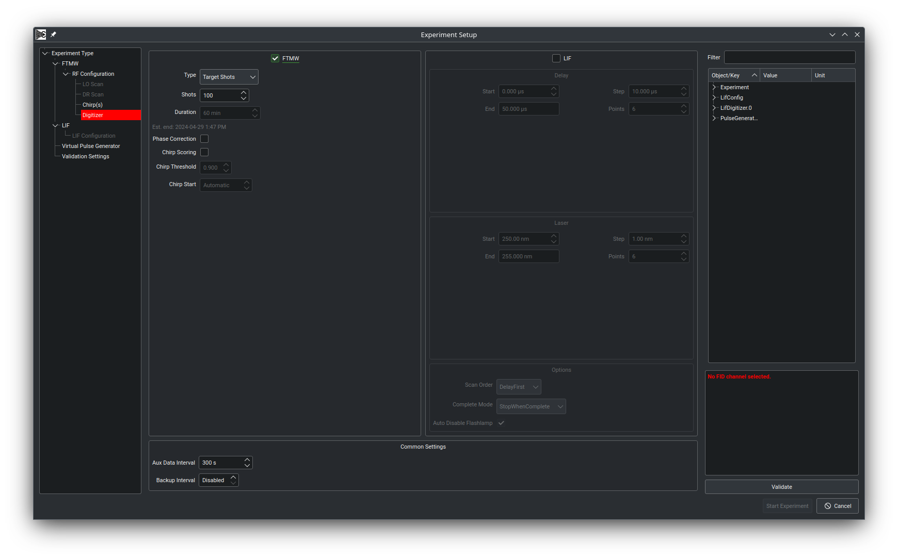

# Blackchirp

Data acquisition software for CP-FTMW spectrometers. Blackchirp is written to control a variety of different CP-FTMW spectrometers with versatile and configurable hardware combinations. At minimum, Blackchirp can function simply by connecting to a high-speed digitizer, but it also supports tunable local oscillators, delay generators, mass flow controllers, analog/digital IO boards, pressure controllers, temperature sensors, and it features a versatile chirp editor which can write chirps or chirp sequences to arbitrary waveform generators. FIDs and FTs are displayed for the user in real time with customizable post-processing settings, allowing a user to monitor the progress during an acquisition. All of Blackchirp's data is written in plain-text semicolon-delimited CSV format so that it can be readily imported into external analysis software.

## What's New

### May 2024

The "Start Experiment" wizard has been completely rewritten to minimize the amount of clicking required to initiate an experiment. All settings are organized into pages which are accessible in any order using the new navigation menu on the left. The dialog attempts to detect incorrect/invalid settings and issues an error or warning if any are identified, as shown in the screenshot below. 

Blackchirp now supports having multiple pieces of hardware of the same "type" for most hardware types. For example, you can now have two pulse generators, etc. This has always been the case for Clocks, but now most other types support this as well. The exceptions are the FtmwScope, AWG, and GpibController types (and the LifScope and LifLaser for the lif module). Because of this change, the hardware keys in the settings file have been changed. If you have been using a previous version of Blackchirp, you can preserve your existing settings by manually editing the config file (~/.config/CrabtreeLab/Blackchirp.conf on Unix, in the Registry on Windows). Simply add ".0" to all hardware keys (e.g., \[AWG\] becomes \[AWG.0\]) with the exception of Clock entries, where you should instead add a dot between "Clock" and the integer attached to it (e.g., \[Clock1\] becomes \[Clock.1\]). For convenience, the hardware keys are: AWG, ClockN (N=0,1,2,...), FlowController, FtmwDigitizer, GpibController, IOBoard, PressureController, PulseGenerator, and TemperatureController. Some may not be present in your config file.

In addition, **hardware selection at compile time has been changed.** Instead of using numbers, now each piece of hardware is identified by its model (case insensitive). See the config.pri.template file for examples.

### April 2023: v1.0 Beta Release

The beta version of Blackchirp v1.0 is now avaialble and recommended for general use! We have been using this version in my lab for about a year now without any major issues.

Major changes:
- Hardware control updates: All hardware controls have moved to windows that are accessible under the Hardware main menu. In addition, "soft" settings that are stored in the config file are editable in the same window.
- Quick experiment updates: Settings from any previous experiment may be loaded from disk and applied to a new experiment, as long as the hardware configuration remains the same.
- Data format updates: All data is now stored in a consistent semicolon-delimited plain text CSV format. FIDs are stored as integers with base-36 encoding instead of the previous binary format.
- User guide: A user guide that documents the main features and usage of Blackchirp is available online, but can also be built locally. To do so, run `make html` from the doc directory. Building the documentation requires doxygen to be installed, and your python environment must have the sphinx, sphinx_rtd_theme, and breathe packages. Other output formats are possible; see the [Sphinx documentation](https://www.sphinx-doc.org/en/master/).
- Plotting: Unified handling of curves/display items on plots so that all plot items are customizable and exportable.

Known issues and to-do items:
- Some pages in the user guide are incomplete. Contributions are welcome!
- The Quantum Composers 9528 delay generator has an error when switching between external trigger mode and internal mode.
- Python module needs implementation and development.

