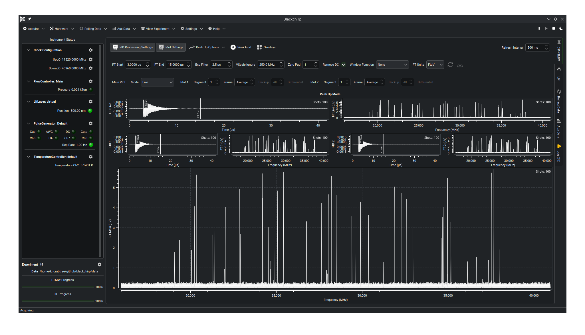

  

<h1 align="center">Blackchirp</h1>

  Open-source data acquisition software for chirped-pulse Fourier transform microwave (CP-FTMW) spectroscopy.

  
  
  
  
  

---

> [!NOTE]
> **Blackchirp 2.0 is in pre-release.** Documentation for the current
> v1.1.0 release is at
> [https://blackchirp.readthedocs.io/1.1.x/](https://blackchirp.readthedocs.io/1.1.x/).
> For information about accessing the 2.0 pre-release, join the
> [Discord server](https://discord.gg/88CkbAKUZY).

Blackchirp drives a CP-FTMW spectrometer end-to-end: it controls the
chirp source, digitizer, and supporting hardware; displays FIDs and
their Fourier transforms in real time; and writes plain-text data that
any analysis environment can read. A companion `blackchirp` Python
package handles offline analysis using the same processing pipeline as
the live application.

  

## Features

- **CP-FTMW acquisition** with real-time FID and FT display, configurable post-processing, and a full-featured chirp editor capable of writing chirps and chirp sequences to supported AWGs.
- **Wide hardware compatibility** — high-speed digitizers, arbitrary waveform generators, tunable local oscillators, delay generators, mass flow controllers, analog and digital IO boards, pressure controllers, and temperature sensors.
- **Runtime hardware configuration** — loadouts and FTMW presets editable without rebuilding; per-instance settings are isolated by stable identifiers.
- **Python hardware drivers** as a first-class implementation type for devices not covered by the built-in C++ drivers.
- **Optional LIF acquisition module** for laser-induced fluorescence experiments.
- **Plain-text data** in a semicolon-delimited CSV format that any analysis environment can parse without a Blackchirp install.
- **Standalone viewer** (`blackchirp-viewer`) for inspecting and comparing experiments without launching the full acquisition application.
- **Companion Python module** for offline FID and LIF analysis with a minimal numpy/scipy/pandas dependency footprint.

## Install

- **Binary packages (recommended):** Windows, macOS, and Linux installers (DEB, RPM, AppImage, DMG, NSIS) are built by CPack and attached to each [GitHub release](https://github.com/kncrabtree/blackchirp/releases). Linux artifacts are GPG-signed with the project's release key (`898734DF7EDBDE45`, [`packaging/blackchirp.asc`](packaging/blackchirp.asc)) and every artifact carries a GitHub build-provenance attestation; see [Verifying releases](https://blackchirp.readthedocs.io/page/user_guide/installation.html#verifying-releases).
- **Supported on:** Windows 10 1809+ / Windows 11; macOS 13.3+ (Apple Silicon and Intel); Ubuntu 24.04+ / Debian 13+ (`.deb`); openSUSE Leap 16+ / Tumbleweed / Fedora 41+ / RHEL 9+ (`.rpm`); any Linux with glibc 2.35+ (AppImage). Per-artifact details: [Supported Platforms](https://blackchirp.readthedocs.io/page/user_guide/installation.html#supported-platforms).
- **Build from source:** see [Installation](https://blackchirp.readthedocs.io/page/user_guide/installation.html) in the user guide.
- **Python analysis module:** `pip install blackchirp` ([PyPI](https://pypi.org/project/blackchirp/)).

For upgrade notes from Blackchirp 1.x, see the
[migration guide](https://blackchirp.readthedocs.io/page/migration.html).
Release-by-release detail is in the
[changelog](https://blackchirp.readthedocs.io/page/changelog.html).

## Documentation

- [User Guide](https://blackchirp.readthedocs.io/page/user_guide/installation.html) — installation, configuration, and day-to-day use.
- [Developer Guide](https://blackchirp.readthedocs.io/page/developer_guide.html) — architecture, conventions, build system, Python module, and contribution workflow.
- [Migration Guide](https://blackchirp.readthedocs.io/page/migration.html) — upgrading from 1.x.
- [Changelog](https://blackchirp.readthedocs.io/page/changelog.html).
- [API Reference](https://blackchirp.readthedocs.io/page/classes.html).
- [Python Module Documentation](https://blackchirp.readthedocs.io/page/python.html).

## Community

- [Discord server](https://discord.gg/88CkbAKUZY) for news, help from other users, and discussion of future improvements.
- [GitHub Issues](https://github.com/kncrabtree/blackchirp/issues) for bug reports and feature requests.
- [CONTRIBUTING.md](CONTRIBUTING.md) for the development workflow.

## License

Blackchirp is distributed under the [MIT License](COPYING). Components
Blackchirp depends on or distributes alongside its source carry their
own license terms; see [`licenses/`](licenses/) for license texts and
attributions.
